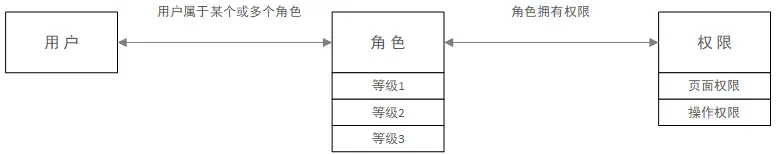
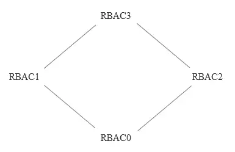
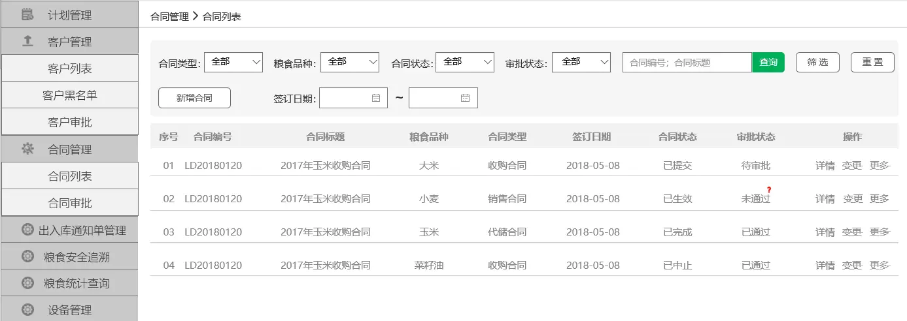
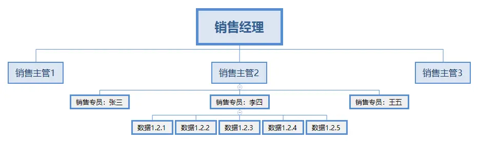
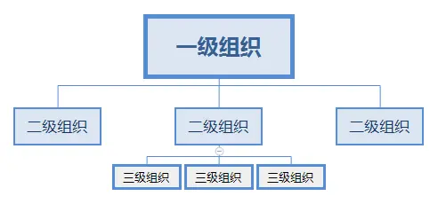

# RBAC模型：基于用户-角色-权限控制的一些思考

本文将从什么是RBAC模型、RBAC模型的分类、什么是权限、用户组的使用、实例分析这几个方面来整理说明。

## 一、什么是RBAC模型

RBAC（Role-Based Access Control）即：基于角色的权限控制。通过角色关联用户，角色关联权限的方式间接赋予用户权限。

为什么不直接给用户分配权限，还多此一举的增加角色这一环节呢？

其实是可以直接给用户分配权限，只是直接给用户分配权限，少了一层关系，扩展性弱了许多，适合那些用户数量、角色类型少的平台。

对于通常的系统，比如：存在多个用户拥有相同的权限，在分配的时候就要分别为这几个用户指定相同的权限，修改时也要为这几个用户的权限进行一一修改。有了角色后，我们只需要为该角色制定好权限后，将相同权限的用户都指定为同一个角色即可，便于权限管理。

对于批量的用户权限调整，只需调整用户关联的角色权限，无需对每一个用户都进行权限调整，既大幅提升权限调整的效率，又降低了漏调权限的概率。

## 二、RBAC模型的分类

RBAC模型可以分为：RBAC0、RBAC1、RBAC2、RBAC3 四种。其中RBAC0是基础，也是最简单的，相当于底层逻辑，RBAC1、RBAC2、RBAC3都是以RBAC0为基础的升级。

一般情况下，使用RBAC0模型就可以满足常规的权限管理系统设计了。

### 2.1 RBAC0模型

最简单的用户、角色、权限模型。这里面又包含了2种：

1. 用户和角色是多对一关系，即：一个用户只充当一种角色，一种角色可以有多个用户担当。
2. 用户和角色是多对多关系，即：一个用户可同时充当多种角色，一种角色可以有多个用户担当。

那么，什么时候该使用多对一的权限体系，什么时候又该使用多对多的权限体系呢？

如果系统功能比较单一，使用人员较少，岗位权限相对清晰且确保不会出现兼岗的情况，此时可以考虑用多对一的权限体系。其余情况尽量使用多对多的权限体系，保证系统的可扩展性。如：张三既是行政，也负责财务工作，那张三就同时拥有行政和财务两个角色的权限。

### 2.2 RBAC1模型

相对于RBAC0模型，增加了子角色，引入了继承概念，即子角色可以继承父角色的所有权限。

**使用场景：**如某个业务部门，有经理、主管、专员。主管的权限不能大于经理，专员的权限不能大于主管，如果采用RBAC0模型做权限系统，极可能出现分配权限失误，最终出现主管拥有经理都没有的权限的情况。

而RBAC1模型就很好解决了这个问题，创建完经理角色并配置好权限后，主管角色的权限继承经理角色的权限，并且支持在经理权限上删减主管权限。

### 2.3 RBAC2模型

基于RBAC0模型，增加了对角色的一些限制：角色互斥、基数约束、先决条件角色等。

- **角色互斥：**同一用户不能分配到一组互斥角色集合中的多个角色，互斥角色是指权限互相制约的两个角色。案例：财务系统中一个用户不能同时被指派给会计角色和审计员角色。
- **基数约束：**一个角色被分配的用户数量受限，它指的是有多少用户能拥有这个角色。例如：一个角色专门为公司CEO创建的，那这个角色的数量是有限的。
- **先决条件角色：**指要想获得较高的权限，要首先拥有低一级的权限。例如：先有副总经理权限，才能有总经理权限。
- **运行时互斥：**例如，允许一个用户具有两个角色的成员资格，但在运行中不可同时激活这两个角色。

### 2.4 RBAC3模型

称为统一模型，它包含了RBAC1和RBAC2，利用传递性，也把RBAC0包括在内，综合了RBAC0、RBAC1和RBAC2的所有特点，这里就不在多描述了。

## **三、什么是权限**

说了这么久用户-角色-权限，可能小伙伴们都了解了什么是用户、什么是角色。但是有的小伙伴会好奇，那权限又是个什么玩意呢？

权限是资源的集合，这里的资源指的是软件中所有的内容，包括模块、菜单、页面、字段、操作功能（增删改查）等等。具体的权限配置上，目前形式多种多样，按照我个人的理解，可以将权限分为：**页面权限、操作权限和数据权限**（这种分类法，主要是结合自己在工作中的实际情况理解总结而来，若有不足之处，也请大家指出）。

**页面权限：**所有系统都是由一个个的页面组成，页面再组成模块，用户是否能看到这个页面的菜单、是否能进入这个页面就称为页面权限。

如下图：

客户列表、客户黑名单、客户审批页面组成了客户管理这个模块。对于普通用户，不能进行审批操作，即无客户审批页面权限，在他的账号登录后侧边导航栏只显示客户列表、客户黑名单两个菜单。

**操作权限：**用户凡是在操作系统中的任何动作、交互都是操作权限，如增删改查等。

**数据权限：**一般业务管理系统，都有数据私密性的要求：哪些人可以看到哪些数据，不可以看到哪些数据。

简单举个例子：某系统中有销售部门，销售专员负责推销商品，销售主管负责管理销售专员日常工作，经理负责组织管理销售主管作业。

如下图：

按照实际理解，‘销售专员张三’登录时，只能看到自己负责的数据；销售主管2登录时，能看到他所领导的所有业务员负责的数据，但看不到其他团队业务员负责的数据。

换另外一句话就是：我的客户只有我和我的直属上级以及直属上级的领导能看到，这就是我理解的数据权限。

要实现数据权限有多种方式：

1. 可以利用RBAC1模型，通过角色分级来实现。
2. 在‘用户-角色-权限’的基础上，增加用户与组织的关联关系，用组织决定用户的数据权限。

具体如何做呢？

**①组织层级划分：**

**②数据可视权限规则制定：**上级组织只能看到下级组织员工负责的数据，而不能看到其他平级组织及其下级组织的员工数据等。

通过以上两点，系统就可以在用户登录时，自动判断要给用户展示哪些数据了。

## **四、用户组的使用**

当平台用户基数增大，角色类型增多时，如果直接给用户配角色，管理员的工作量就会很大。这时候我们可以引入一个概念“用户组”，就是将相同属性的用户归类到一起。

例如：加入用户组的概念后，可以将部门看做一个用户组，再给这个部门直接赋予角色（1万员工部门可能就几十个），使部门拥有部门权限，这样这个部门的所有用户都有了部门权限，而不需要为每一个用户再单独指定角色，极大的减少了分配权限的工作量。

同时，也可以为特定的用户指定角色，这样用户除了拥有所属用户组的所有权限外，还拥有自身特定的权限。

用户组的优点，除了减少工作量，还有更便于理解、增加多级管理关系等。如：我们在进行组织机构配置的时候，除了加入部门，还可以加入科室、岗位等层级，来为用户组内部成员的权限进行等级上的区分。

关于用户组的详细疑难解答，请查看https://wen.woshipm.com/question/detail/88fues.html。在这里也十分感谢为我解答疑惑的朋友们！